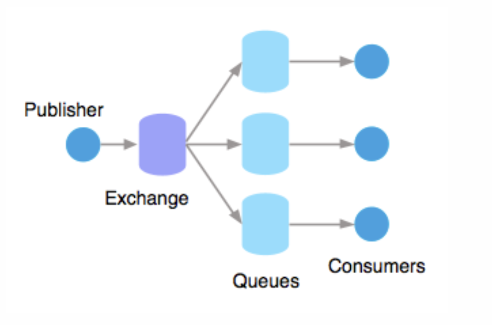
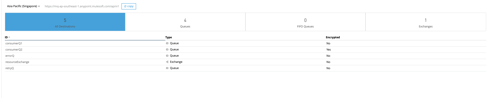
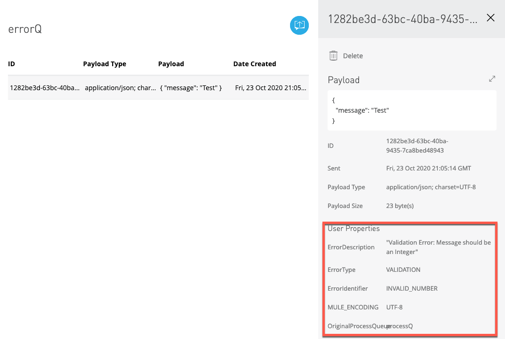

# Publish-Subscribe Messaging Using Anypoint MQ

This is an example API to showcase how Publish-Subscribe messaging can be achieved using Anypoint MQ as a messaging platform. The sample also comes with exhaustive admin functions which provides the below functions using the Anypoint Platform APIs to automate new subscriber onboarding:

1. Create a subscriber (Anypoint MQ , and Client App)  and bind to the topic
2. Delete a subscriber ( Anypoint MQ , and Client App)
3. Reset Client App Credentials.

### Why?
Publish/subscribe messaging, or pub/sub messaging, is a form of asynchronous service-to-service communication used in serverless and microservices architectures. In a pub/sub model, any message published to a topic is immediately received by all of the subscribers to the topic. Pub/sub messaging can be used to enable event-driven architectures, or to decouple applications in order to increase performance, reliability and scalability.

The subscribers to the message topic often perform different functions, and can each do something different with the message in parallel. The publisher doesn’t need to know who is using the information that it is broadcasting, and the subscribers don’t need to know who the message comes from. This style of messaging is a bit different than message queues, where the component that sends the message often knows the destination it is sending to.

In the context of Anypoint MQ , the topic function is accomplished using  Message Exchanges. To learn more about Anypoint MQ , please refer https://docs.mulesoft.com/mq/

### How?

The following diagram should articulate how this can be implemented:

With message exchanges you can distribute a single message to multiple consumers.

For example, if a publisher publishes changes in the weather, and you have multiple apps that want to receive that data, you can use a message exchange to publish a single message to multiple queues for each app. A binding is a relationship between the queue and message exchange, which tells the message exchange where to send messages. A queue can be bound to multiple message exchanges.

### Configuration
To test this example, you will require access to Anypoint MQ.

1. Create 4 Queues - consumerQ1, consumerQ2 , retryQ and errorQ in the region of your choice.

   This sample uses queues which have been created in the Singapore region. You may change the region by the configuring the property key ${amq.endpoint}

2. Setup the consumerQ1/consumerQ2 as follows (Set DLQ as RetryQ and Delivery Attempts as desired)

3. When a non-retriable error occurs the message is pushed to ErrorQ with the following user attributes. These should help Operations team to understand the error cause and action appropriately.

4. Create the message Exchange and create bindings with the consumerQ1, consumerQ2

5. Configure the Anypoint MQ Client ID and Client Secret in the secure properties against the keys ${amq.clientid} and ${amq.secret}

6. The Anypoint MQ Platform APIs do not support Connected Apps, hence platform user credentials will need to be configured in the secure properties against the keys ${platformUser.username} and ${platformUser.password}

7. Configure the orgId , envId and region to enable the use of admin endpoints in the env specific properies file, against the keys ${amqAdmin.orgId} , ${amqAdmin.envId} and ${amqAdmin.region}

7. Configure the keystore details in the secure properties against the keys ${keystore.keyPassword} , ${keystore.password} and ${keystore.alias}

#### Development
Please note - as part of the template, the consumption flows have also been implemented within the same Mule project, to demonstrate the pattern. However, it is recommended to keep the consumer implementations independent of the subscriber.

You may refer to the Reliable messaging template as a baseline to implement the consumer flows and error handling.

##### Dependencies

### Contribution

Neha Das

Just fork the repo, make your updates and open a pull request!

### Todos

License
----
UNLICENSED
